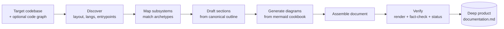

# deep-docs

Turn any finished (or in-progress) codebase into a **deep, client-grade product documentation set** — the kind of document a new hire, an integrating engineer, a QA lead, or a business stakeholder can each open and understand the whole system from. Every major concept is illustrated with a **technical mermaid diagram** (architecture, data flow, sequence, state, DAG, ER, deployment, CI/CD).

The plugin is **general-purpose and language/domain-agnostic**. It does not assume your project is written in any particular language or shaped like any particular product. It ships a *methodology* — how to discover a codebase, how to reverse-engineer its subsystems, how to document a custom config/DSL, how to diagram it — and a *canonical outline* that adapts itself to whatever actually exists in the target repo.

## Components

| Component | Type | What it does |
| --- | --- | --- |
| `document-product` | Skill | The primary generator. Discovers the codebase, maps its subsystems, and produces the full deep-documentation markdown with all sections and diagrams. Also refreshes an existing doc set after code changes. |
| `diagram-codebase` | Skill | Focused companion. Produces just the technical mermaid diagram set for a whole system or a single subsystem — useful when you only want diagrams (e.g. to drop into a README or wiki). |

Both skills share one reference library (under `skills/document-product/references/`) so the diagram vocabulary and discovery method stay consistent.

## Usage

Trigger the primary skill by asking, in a session that can see the target codebase:

- "Document this product / generate deep product documentation for this repo"
- "Write full architecture docs for this codebase, with diagrams"
- "Produce a handoff / onboarding document for this project"
- "Update the product docs — the code changed"

Trigger the diagram companion with:

- "Generate architecture diagrams for this codebase"
- "Draw the data flow / sequence / DAG for the &lt;subsystem&gt;"
- "Add mermaid diagrams to the README"

The skill works best when it can actually read the code. Point it at a folder, a repo, or connect the project directory. If you have a **code graph** (for example an export from Graphify or any tool that emits nodes-and-edges over your symbols/modules), mention it — the discovery step will ingest it to drive the architecture and dependency diagrams.

## How it works (at a glance)

## Setup

No configuration, environment variables, or external services are required. The skills use only the file, search, and shell tools already available in the session. If a Mermaid-rendering MCP is connected it will be used to validate diagrams; otherwise diagrams are validated by syntax rules and, when available, a local `mmdc` (mermaid-cli).

## Customization

This plugin has no organization-specific placeholders — it is meant to be used as-is on any project. If you want to bias the output toward a house style (fixed section order, a company glossary, a preferred diagram theme), edit `skills/document-product/assets/report-skeleton.md` and the outline in `skills/document-product/references/documentation-outline.md`.
