<!--
  DEEP PRODUCT DOCUMENTATION — fill-in skeleton.
  Copy this, then replace every <PLACEHOLDER> and each example mermaid block with
  system-specific content. Delete sections that do not apply (see the outline's
  applicability rule). Keep the "Documentation confidence" appendix honest.
-->

# <PRODUCT NAME> — Product Documentation

> <One-line definition of what the product is and does.>

| | |
| --- | --- |
| Version | <doc version> |
| Date | <date> |
| Source | <repo> @ <branch/commit> |
| Audience | <who this is for> |
| Status summary | <e.g. core shipped; device service partial> |

### How to read this document

<Two sentences on structure.> Use the audience map below to jump to what matters to you.

| Persona | Start with |
| --- | --- |
| End user | §1, §16 |
| Developer / integrator | §2–3, §14 |
| Tester / QA | §11, §12 |
| Ops / SRE | §10, §12 |
| Business / client | §1, §15 |

## Table of contents

1. [Overview](#1-overview) · 2. [High-level architecture](#2-high-level-architecture) · 3. [Low-level architecture](#3-low-level-architecture) · 4. [Core concepts & domain model](#4-core-concepts--domain-model) · 5. [Subsystem deep-dives](#5-subsystem-deep-dives) · 6. [Dedicated service](#6-dedicated-service) · 7. [Technology stack](#7-technology-stack--rationale) · 8. [End-to-end data flow](#8-end-to-end-data-flow) · 9. [Configuration & DSL](#9-configuration--custom-dsl) · 10. [Setup](#10-setup--installation) · 11. [Testing](#11-testing) · 12. [Debugging & operations](#12-operations-observability--debugging) · 13. [Stakeholder perspectives](#13-stakeholder-perspectives) · 14. [Extending](#14-extending-the-product) · 15. [Status](#15-status-done-vs-pending) · 16. [FAQ](#16-faq) · 17. [Glossary](#17-glossary) · 18. [Appendices](#18-appendices)

---

## 1. Overview

<What problem it solves, who uses it, core capabilities, the shape in a few sentences, and the primary journey in one paragraph.>

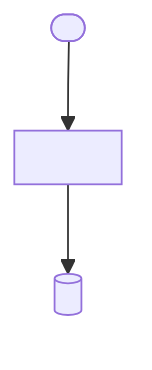

## 2. High-level architecture

<Layers/services, responsibilities, boundaries, sync vs async, where state lives, and why decomposed this way.>

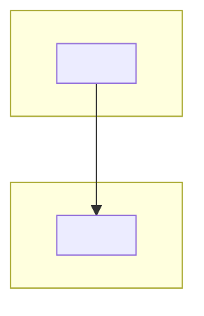

## 3. Low-level architecture

<Core modules, interfaces, key abstractions, design patterns and why.>

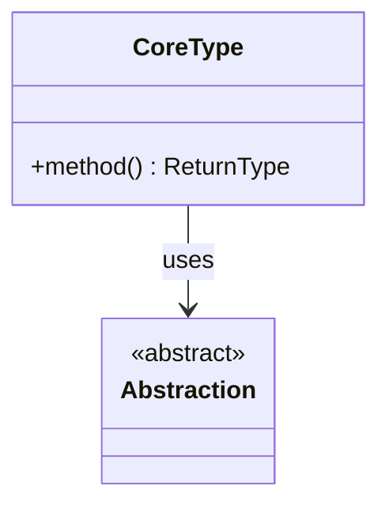

## 4. Core concepts & domain model

<Define each core concept, its lifecycle, and relationships. Seeds the glossary.>

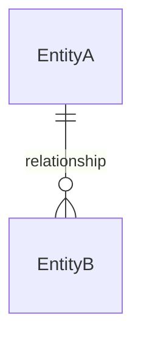

## 5. Subsystem deep-dives

<Repeat this block per real subsystem, ordered along the primary flow.>

### 5.x <Subsystem name> (<archetype>)

- **Responsibility:** <…> **Not responsible for:** <…>
- **Where it lives:** `<path>` — entry: `<symbol>`
- **How it works:** <step-by-step prose walking a real operation, naming functions/classes.>
- **Key data structures:** <types + notable fields.>
- **Interfaces & contracts:** <how it's called / what it calls.>
- **Configuration:** <knobs; link §9.>
- **Concurrency & state:** <threading/async, shared state, guarantees.>
- **Failure modes:** <what breaks; link §12.>
- **Extension points:** <how to add to it; link §14.>

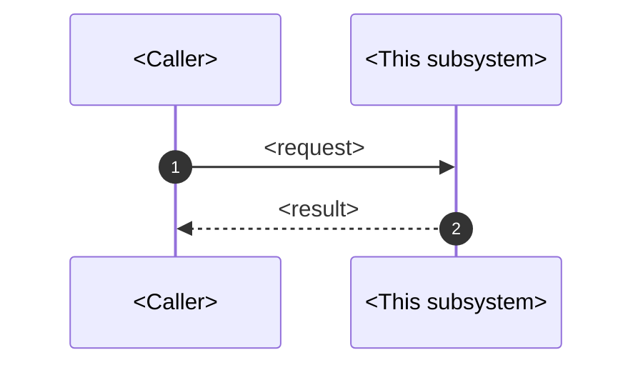

## 6. Dedicated service <NAME>

<Only if a standalone service exists (e.g. a device service). Full treatment: purpose, internal architecture, own data flow, interface to the core, lifecycle & health, config, failure modes, run/test in isolation.>

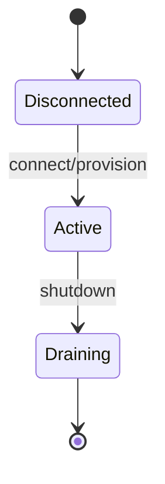

## 7. Technology stack & rationale

| Layer / concern | Technology | Why chosen here | Role in this codebase | Trade-offs / alternatives |
| --- | --- | --- | --- | --- |
| Language | <…> | <…> | <…> | <…> |
| Framework | <…> | <…> | <…> | <…> |
| Data store | <…> | <…> | <…> | <…> |
| … | | | | |

<Prose for the non-obvious choices.>

## 8. End-to-end data flow

<Numbered narrative from entry to output, naming each hop, the data shape/transform, persistence, branches, and failure points.>

```mermaid
sequenceDiagram
    autonumber
    actor U as <User>
    participant S1 as <Subsystem>
    participant S2 as <Subsystem>
    U->>S1: <input>
    S1->>S2: <hand-off>
    S2-->>U: <output/report>
```

```mermaid
flowchart LR
    in[/<input>/] --> t1[<transform>] --> store[(<store>)] --> out[/<report>/]
```

## 9. Configuration & custom DSL

<Structure/grammar, key reference table, worked examples minimal→advanced, validation/errors, gotchas. See dsl guide.>

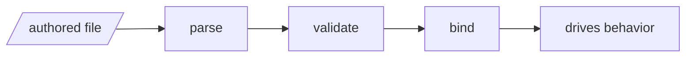

Key reference:

| Key | Type | Required | Default | Allowed | Effect | Example |
| --- | --- | --- | --- | --- | --- | --- |
| `<key>` | <type> | <y/n> | <default> | <values> | <effect> | `<example>` |

## 10. Setup & installation

### Local

<Prereqs → install → config/secrets → dependencies → init → run → verify → teardown, with real commands.>

### Production / CI-CD

<Triggers, stages, build/packaging, environments, deploy strategy, approvals, rollback, secrets, observability.>

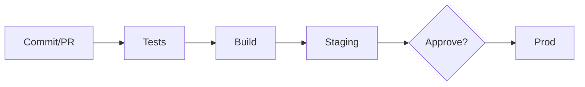

## 11. Testing

<Layers, how to run each, coverage, fixtures/mocks, how to write a new test, CI gating.>

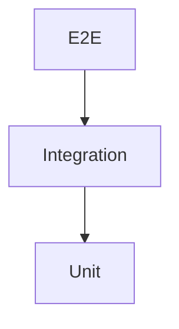

## 12. Operations, observability & debugging

<Observability inventory; failure-mode runbooks; troubleshooting trees.>

| Symptom | Likely cause | Confirm | Fix |
| --- | --- | --- | --- |
| <…> | <…> | <…> | <…> |

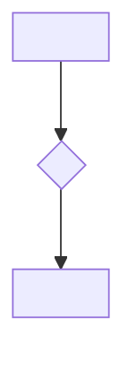

## 13. Stakeholder perspectives

### End user
<…>
### Developer / integrator
<…>
### Tester / QA
<…>
### Ops / SRE
<…>
### Business / client
<…>
### Security
<…>

## 14. Extending the product

<Worked walk-throughs for the real extension points: new plugin, new node type, new handler/agent, new config option, new service.>

## 15. Status: done vs pending

| Capability | Status | Evidence | Notes / gaps |
| --- | --- | --- | --- |
| <…> | ✅/🟡/⛔/⚠ | <…> | <…> |

**Known limitations & risks:** <…>

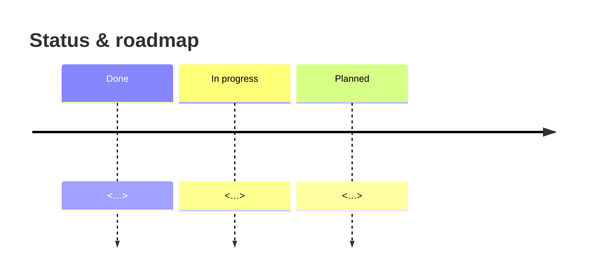

## 16. FAQ

**Q: <question grounded in this system>?** <answer; link to section.>

## 17. Glossary

**<Term>** — <definition.>

## 18. Appendices

- **Directory map:** <annotated tree.>
- **Config key index:** <all keys.>
- **API/endpoint index:** <…>
- **Environment variables:** <name · purpose · required · where set.>
- **Documentation confidence:** verified — <…>; ⚠ unverified — <…>.
