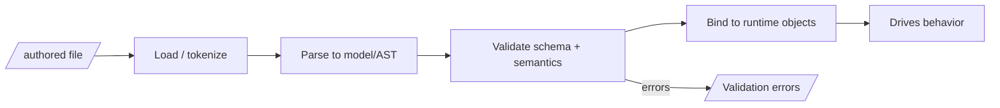
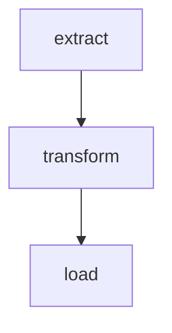

# Documenting a custom config / DSL

Use this when the target system has a **configuration surface, a custom DSL, plugin manifests, or a DAG/pipeline YAML** — anything where a human authors a structured file that drives behavior. The goal of the resulting section is that a reader can (a) understand every key and (b) **write a valid file from scratch**, guided from a minimal example to an advanced one.

This is a *reverse-engineering* method: the config's real contract is defined by the code that parses and consumes it, not by any prose that may exist.

## Step 1 — Find the definition

Locate, in order:

1. **The loader/parser** — where the file is read and turned into an internal object. Search for the file extension, `load`, `parse`, schema libraries (`pydantic`, `zod`, `marshmallow`, `jsonschema`, `cerberus`, `go` struct tags, `serde`), or a real grammar (`lark`, `antlr`, `pyparsing`, `.g4`).
2. **The schema/model** — the class/struct/schema that lists the fields, types, defaults, and validation. This is your primary source for the key reference.
3. **Example files** — real `*.yml/yaml/toml/json` or DSL files in the repo (often under `examples/`, `config/`, `tests/`, or fixtures). These show idiomatic usage.

## Step 2 — Find every consumer (what each key *does*)

A key's meaning is its effect. For each field, find where it is read and trace the behavior it changes.

```bash
rg -n '\bkey_name\b|config\.key_name|cfg\["key_name"\]|settings\.key_name'
```

Record, per key: the code path it influences and the observable behavior. This is what turns a dry schema into an explanatory reference.

## Step 3 — Establish structure / grammar

- For **schema-based configs** (YAML/JSON/TOML validated by a model): document the object tree — top-level sections, nesting, and repeatable blocks.
- For a **true DSL** (custom syntax): document the grammar. Give the token types, the production rules in readable form (or EBNF if one exists), and how the parser builds the AST. Show the mapping from syntax → internal model.

Diagram the pipeline the file goes through:



And, if there is a schema, a class diagram of it (top-level → nested types), using the classDiagram template from the mermaid cookbook.

## Step 4 — Build the key reference

The core artifact. One row per key, at every nesting level (use dotted paths like `pipeline.nodes[].retries`).

| Key | Type | Required | Default | Allowed / range | Effect (what it changes) | Example |
| --- | --- | --- | --- | --- | --- | --- |
| `name` | string | yes | — | non-empty | Human label for the run | `"nightly-etl"` |
| `pipeline.nodes[]` | list | yes | — | ≥1 item | The tasks to execute | see below |
| `pipeline.nodes[].type` | enum | yes | — | registered node types | Selects the handler class | `"transform"` |
| `pipeline.nodes[].depends_on` | list[str] | no | `[]` | existing node ids | Edges of the DAG | `["extract"]` |
| `pipeline.nodes[].params` | map | no | `{}` | per-type schema | Passed to the handler | `{path: "/in"}` |
| `pipeline.nodes[].retries` | int | no | `0` | ≥0 | Retry attempts on failure | `3` |

Populate the *real* keys from the schema. For enums, list the actual allowed values (e.g. the registered node/plugin type names — cross-reference the registry). Mark any key whose effect you could not fully trace as `⚠ unverified`.

## Step 5 — Document the mechanics beyond keys

Explain the behaviors that keys alone don't reveal:

- **Scoping / inheritance / overrides** — do global values cascade into blocks? Can a node override a default? What is the precedence order (env > file > default, etc.)?
- **Interpolation / templating** — variable substitution (`${VAR}`, `{{ jinja }}`), references between fields, secrets injection.
- **References between files** — includes, imports, `extends`, base configs.
- **Ordering & identity** — are ids required unique? Does list order matter?
- **Computed/derived values** — anything the loader fills in.

## Step 6 — Author-from-scratch tutorial

Teach by progression. Show real, runnable files, each fully explained.

**6a. Minimal viable file** — the smallest thing that validates and runs. Explain every line.

```yaml
name: hello
pipeline:
  nodes:
    - id: greet
      type: log
      params: { message: "hello world" }
```

**6b. Realistic file** — introduce dependencies, params, and multiple node types; explain the DAG that results and render it:

```yaml
name: nightly-etl
pipeline:
  nodes:
    - id: extract
      type: http_fetch
      params: { url: "https://example/data.json" }
    - id: transform
      type: jq
      depends_on: [extract]
      params: { expr: ".items[]" }
    - id: load
      type: db_write
      depends_on: [transform]
      params: { table: "items" }
```



**6c. Advanced file** — show the powerful features: fan-out/fan-in, retries, conditionals, templating, environment overrides, plugin usage. Explain each addition and when to reach for it.

**6d. Common patterns & recipes** — a handful of copy-paste patterns the reader will actually need (parallel branches, optional steps, parameterized reuse, secret handling).

## Step 7 — Validation & errors

- How is a file validated (schema + semantic checks like "depends_on must reference an existing id", "no cycles")?
- How does the reader validate *before* running (a `validate`/`lint` command, dry-run, schema file)?
- Show 2–3 real error messages and what they mean / how to fix.

## Step 8 — Gotchas & tips

List the traps discovered in the code: YAML type surprises (`no`→false, numeric strings), whitespace/indent rules, reserved keys, case sensitivity, silent-default vs hard-fail behavior, ordering dependencies.

---

## Special case: DAG / pipeline YAML

When the config defines a task graph, additionally cover: how nodes and edges are declared, how the scheduler builds and validates the DAG (topological sort, cycle detection), what "ready" means, fan-out and fan-in, conditional/branching edges, per-node retries/timeouts, parameter passing between nodes, and parallelism limits. Always render at least one real DAG from a sample file so the reader connects YAML to graph.

## Special case: plugin manifests / plugin config

When the DSL configures a plugin/extension system, cover: the manifest schema (name, version, entry point, capabilities, dependencies, permissions), how the host discovers and loads it, the contract a plugin must satisfy (interface/hooks it implements), and a **worked "write a plugin from scratch"** example — the minimal manifest + minimal implementation that the host will accept, then how to register and invoke it. Cross-link this to the "Extending the product" section.
