# Mermaid cookbook

A template + guidance for every diagram type the documentation uses. Substitute **real** component names, steps, states, and tables from the target system — never ship the placeholder labels. Keep each diagram legible: aim for ≤ 20 nodes; if bigger, split into one overview diagram plus per-area detail diagrams.

Always end by **validating** every diagram (see the last section).

## Which diagram for which question

| You want to show… | Use | Mermaid type |
| --- | --- | --- |
| The product and the actors/systems around it | System context | `flowchart` |
| Major layers/services and how they connect | Container / component | `flowchart` + `subgraph` |
| Internal classes/modules and relationships | Class / component detail | `classDiagram` |
| Who-imports-who / dependency structure | Dependency graph | `flowchart` |
| A behavior over time across components | Sequence | `sequenceDiagram` |
| Data moving and being transformed/stored | Data flow | `flowchart` (LR) + stores |
| A lifecycle (job, agent, session, device) | State machine | `stateDiagram-v2` |
| The persistent data model | Entities | `erDiagram` |
| Tasks with dependencies / a pipeline | DAG | `flowchart` |
| Runtime hosts/containers/network | Deployment | `flowchart` + `subgraph` |
| Build → test → deploy stages | CI/CD pipeline | `flowchart` |
| Milestones over time | Roadmap | `gantt` or `timeline` |
| An end-user's path through the product | Journey | `journey` |

---

## 1. System context

Purpose: the outermost view — the product as one box, surrounded by the users and external systems it talks to.

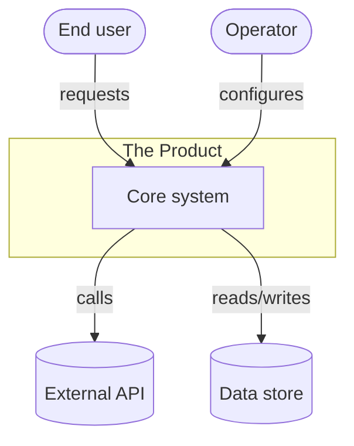

Tips: actors as `([rounded])`, data stores as `[(cylinder)]`, the product as a `subgraph`. Keep external systems to those that truly cross the boundary.

## 2. Container / component (high-level architecture)

Purpose: the major layers/services and their runtime relationships. This is the primary architecture diagram.

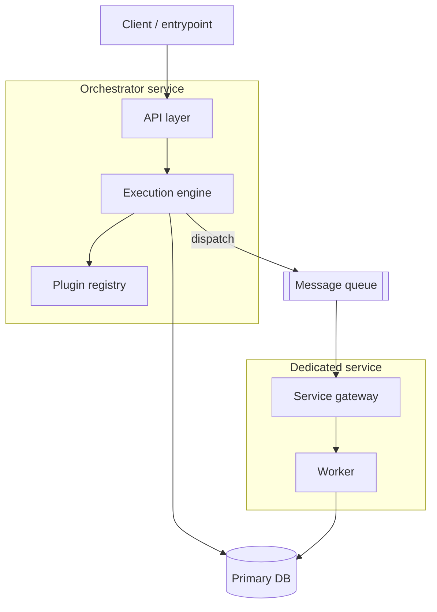

Tips: one `subgraph` per service/layer. Use `[[queue]]` for queues. Label edges with the *nature* of the call (dispatch, query, stream). Direction `TB` for layers, `LR` for pipelines.

## 3. Class / component detail (low-level architecture)

Purpose: the internal structure of the core — key types, their members, and relationships.

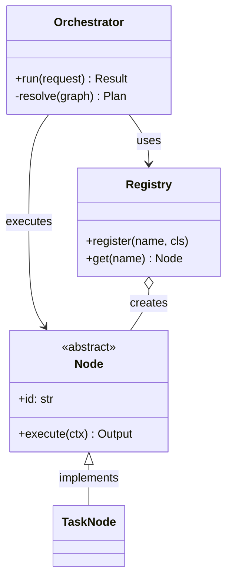

Tips: `<<abstract>>`/`<<interface>>` stereotypes for seams. `<|--` inheritance, `-->` association, `o--` aggregation, `*--` composition. Only include architecturally meaningful members, not every field.

## 4. Dependency graph

Purpose: module/package dependency direction (often derived from imports or a code graph). Reveals layering and cycles.

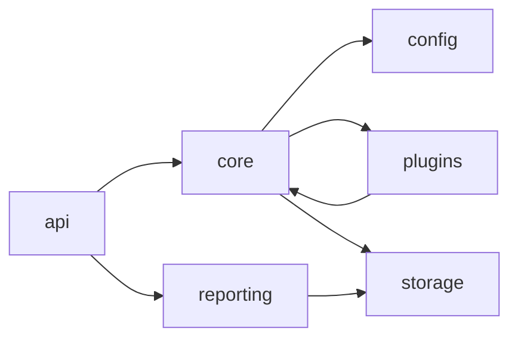

Tips: collapse to module level. If the code graph shows a cycle (e.g. `plugins <-> core`), keep it and call it out in prose as coupling.

## 5. Sequence (behavior / flow)

Purpose: a specific operation over time across components — the workhorse for "how does X actually happen". Use for the end-to-end journey and each major flow.

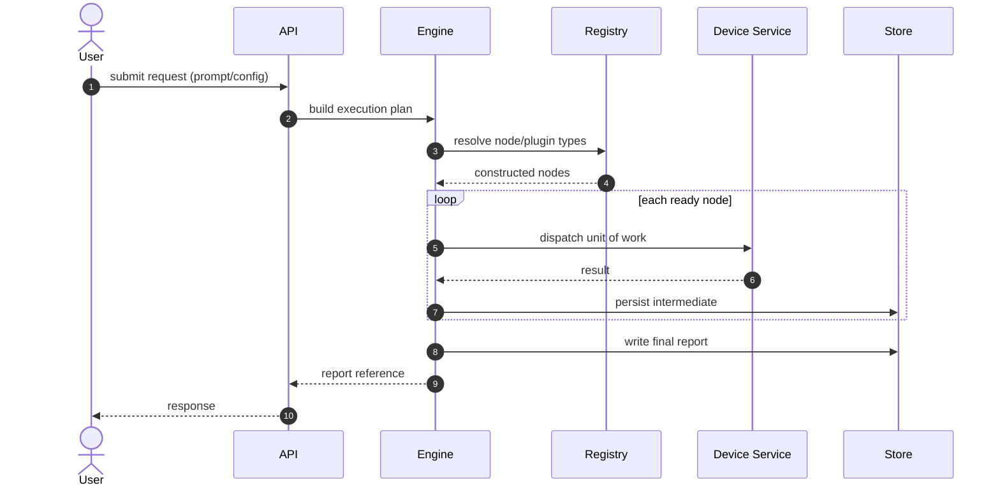

Tips: `autonumber` for step references from prose. `->>` call, `-->>` return, `actor` for humans. Use `loop`/`alt`/`opt`/`par` for iteration, branching, optional, and parallel paths. This is where "prompt → report" journeys shine.

## 6. Data flow

Purpose: how data moves, transforms, and lands — distinct from control flow. Show data stores explicitly.

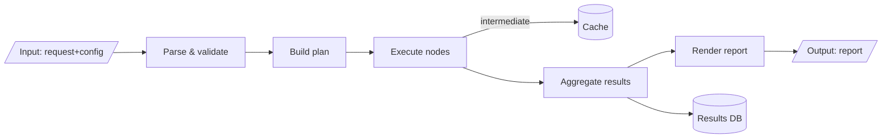

Tips: `[/parallelogram/]` for I/O data, `[(cylinder)]` for stores. Label edges with the data payload where it clarifies. Draw one for the whole system, and one per service if internal flows differ.

## 7. State machine (lifecycle)

Purpose: the lifecycle of a stateful thing — a job, an agent, a session, a device connection.

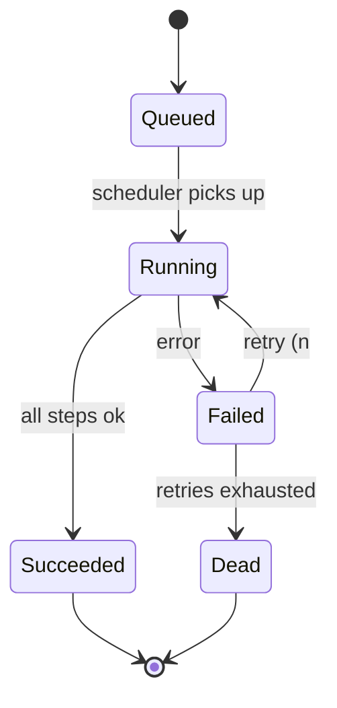

Tips: `[*]` start/end. Label transitions with their trigger/condition. Use `state X { ... }` for nested/composite states (e.g. a device "Active" state containing sub-states).

## 8. Entity-relationship (data model)

Purpose: the persistent data model — tables/collections and their relationships.

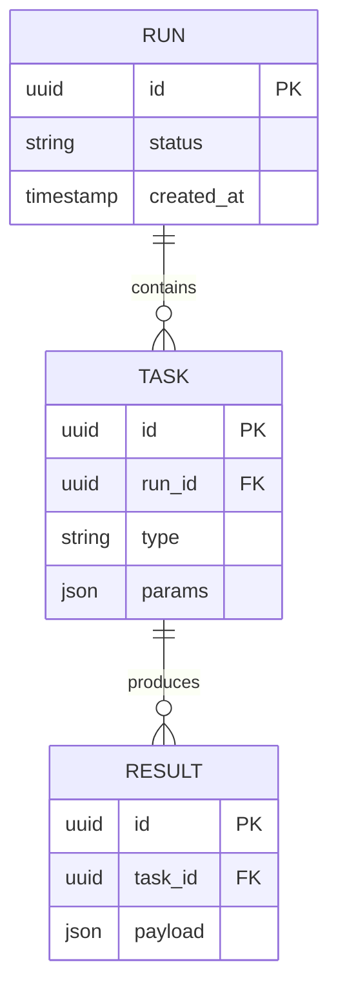

Tips: crow's-foot cardinality: `||--o{` one-to-many, `}o--o{` many-to-many, `||--||` one-to-one. Include PK/FK and the columns that matter. Derive from ORM models/migrations.

## 9. DAG / pipeline

Purpose: tasks with dependencies, executed in dependency order — for schedulers/orchestrators/build graphs. If the system has a config-defined DAG, render an actual sample from a real config file.

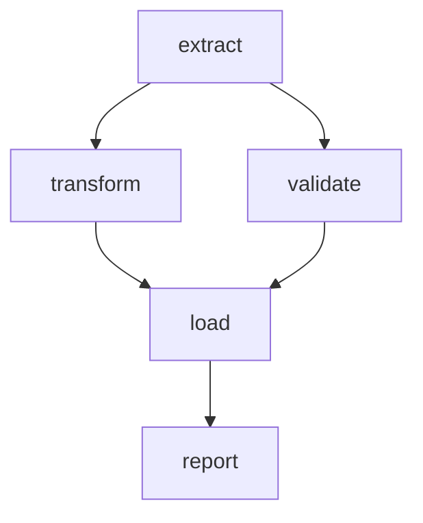

Tips: `TD` top-down reads like a dependency tree. Show fan-out (one→many) and fan-in (many→one) since those are the interesting scheduling cases. Annotate parallelizable branches in prose.

## 10. Deployment / topology

Purpose: where things run — processes, containers, hosts, networks.

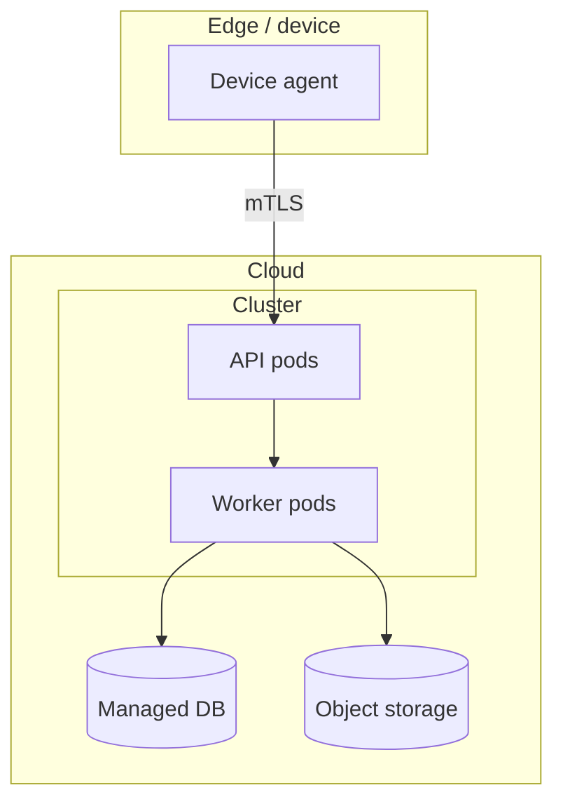

Tips: nest `subgraph`s for network/trust zones. Label links with protocol/security (mTLS, HTTPS, gRPC). Derive from Docker/k8s/terraform.

## 11. CI/CD pipeline

Purpose: the path from commit to production.

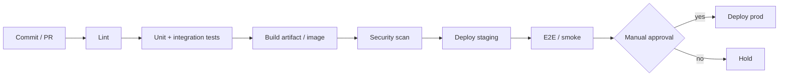

Tips: `{diamond}` for gates/approvals. Mirror the real stage names from the CI config. A `gitGraph` is an alternative when branching strategy is the point.

## 12. Roadmap (status §15)

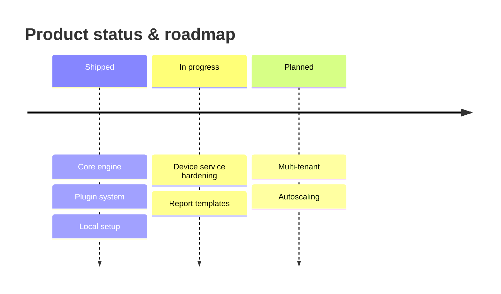

Or a `gantt` when dates matter. Keep it honest — mirror the status table.

## 13. User journey (optional, for §13 end-user view)

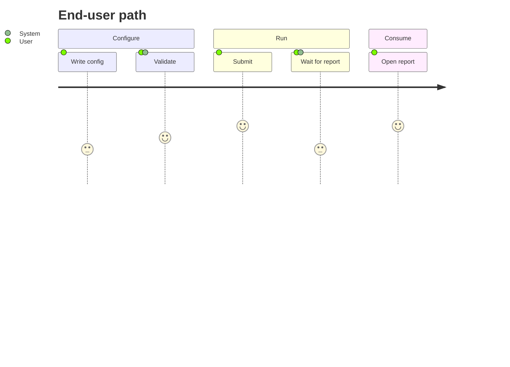

---

## Syntax gotchas & how to keep diagrams rendering

- **Quote labels with special characters.** Parentheses, colons, commas, or `/` in a node label can break parsing — wrap in quotes: `A["run(request): Result"]`. In sequence diagrams, avoid unescaped `:` inside message text.
- **No raw `end` as a node id** (reserved) — capitalize or rename (`End`, `finish`).
- **` ` for line breaks** inside labels; keep labels short.
- **One diagram type per fenced block.** Don't mix `flowchart` and `sequenceDiagram`.
- **Consistent direction**; pick `TB`/`LR` deliberately. `LR` for pipelines/flows, `TB` for layers/hierarchies.
- **Comments** start with `%%`.
- **Edge labels**: `A -->|label| B` (flowchart) / `A->>B: label` (sequence).
- **Keep it legible**: split when a diagram exceeds ~20 nodes or crosses too many edges; a set of focused diagrams beats one hairball.

### Optional theming (light/dark safe)

Prefer default theme (renders on both). Only if the client wants styling, set high-contrast classes rather than hard-coded colors:

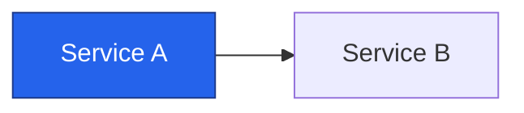

## Validation (do this every time)

1. If a **Mermaid rendering MCP** is connected (e.g. a `validate_and_render` tool), pass each diagram through it and fix reported errors.
2. Else, if `mmdc` (mermaid-cli) is available: `mmdc -i diagram.mmd -o /tmp/out.svg` and confirm it renders.
3. Else, self-check against the gotchas list above: balanced brackets/quotes, valid arrows, no reserved ids, single diagram type per block.

Never leave a diagram in the deliverable that has not passed at least the self-check.
