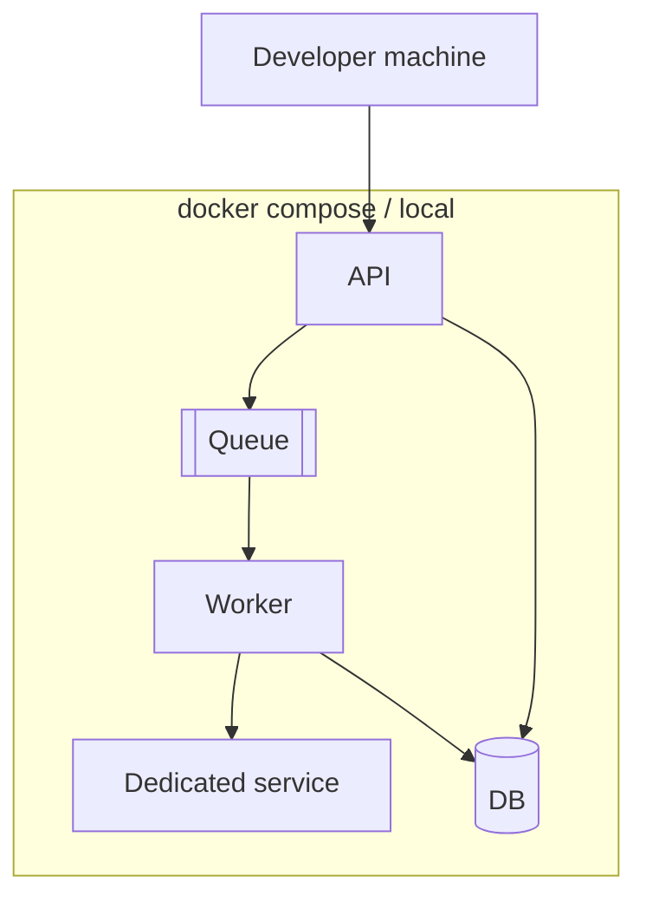
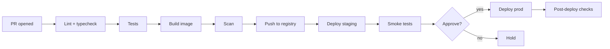
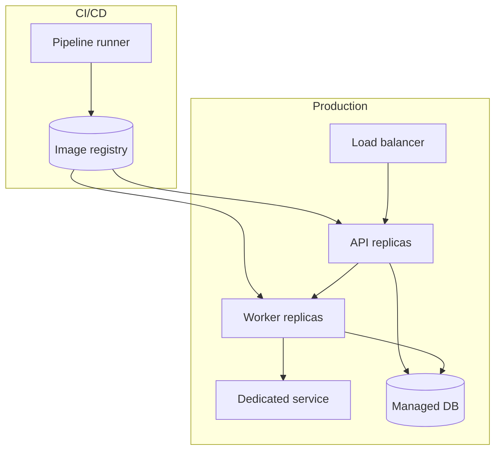

# Setup & CI/CD documentation guide

Produce two things a reader can follow literally: **(A) get it running locally** and **(B) understand how it builds, tests, and ships to production**. Both must be reverse-engineered from the real scripts and CI config, not idealized. Every command you document should be one you found in the repo or verified.

## A. Local setup

Document the happy path as an ordered, copy-pasteable sequence, then the failure points.

1. **Prerequisites** — language runtime + exact versions (from `.tool-versions`, `engines`, `go.mod`, `Dockerfile` base image), required system tools, and services the app needs locally (DB, queue, cache). State how to get each.
2. **Get the code & dependencies** — clone, and the *real* install command (`npm ci`, `pip install -e .`, `go mod download`, `make setup`). Prefer what the README/Makefile actually uses.
3. **Configuration & secrets** — copy the env template (`.env.example` → `.env`), and document every required variable (name, purpose, example/where to get it). Cross-reference the config section for file-based config. Never print real secret values.
4. **Bring up dependencies** — the local stack, ideally one command (`docker compose up -d`, `make services`). List what each container is.
5. **Initialize** — migrations, seed data, first-run setup.
6. **Run** — the command(s) to start each component (API, workers, the dedicated service, UI). Note the ports/URLs.
7. **Verify** — a concrete success check: hit a health endpoint, run the smoke test, or execute the minimal end-to-end example (e.g. submit the minimal config and see a report). Show expected output.
8. **Teardown** — how to stop and clean up.

Diagram the local runtime:

**Common local setup failures** — enumerate the real ones (missing version, port already in use, unset env var, migration not run, service not ready before app starts) with the fix for each. Feed these into the debugging section too.

## B. Production / CI-CD

Reverse-engineer from CI config (`.github/workflows/*.yml`, `.gitlab-ci.yml`, `Jenkinsfile`, `circleci`, `azure-pipelines`) and infra-as-code (`Dockerfile`, `compose`, `helm`/`k8s`, `terraform`, `serverless`). Document the pipeline *as it is*.

Cover:

1. **Trigger & branching model** — what runs on PR vs main vs tag; the release branching strategy (trunk-based, gitflow, release branches).
2. **Stages** — lint, typecheck, unit/integration tests, build, artifact/image creation, security scanning, publish, deploy to each environment, post-deploy verification. Name them exactly as the CI defines them.
3. **Build & packaging** — how artifacts/images are built, tagged, and stored (registry, versioning scheme).
4. **Environments** — dev/staging/prod: how they differ, how config/secrets are injected per environment, promotion flow.
5. **Deployment strategy** — rolling, blue/green, canary; how traffic shifts; migration handling during deploy.
6. **Approvals & gates** — manual approvals, required checks, protected environments.
7. **Rollback** — the exact procedure and what triggers it.
8. **Secrets management** — where secrets live (CI secrets, vault, cloud secret manager) and how they reach the runtime. Never expose values.
9. **Observability hooks** — what the pipeline wires up (dashboards, alerts, release markers).

Diagram the pipeline (mirror the real stage names):

And the deployment topology:

## What to produce in the document

- A local "quickstart" the reader can follow end to end, ending in a verified run.
- A full environment-variable / secret index (name, purpose, required?, where set) — also surface this in the appendix.
- The CI/CD narrative + the two diagrams above, using the project's real stage and environment names.
- A short "release process" runbook: how a change goes from merged to live, and how to roll back.

If any piece cannot be found (e.g. no CI config exists), state that plainly and describe what would be needed — do not invent a pipeline.
