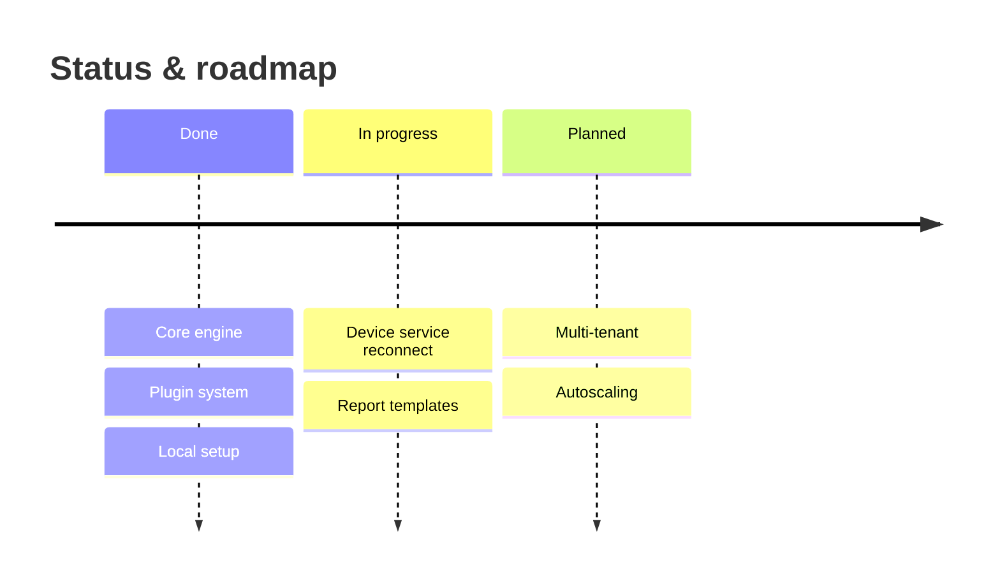

# Status: done vs pending

The client asked to know **what is built and what is not**. This section must be *honest and evidence-based* — never marketing. Every status claim is backed by a signal in the repo, and anything you could not verify is labelled.

## Gather the signals

Combine several sources; no single one is sufficient.

- **In-code markers** — `TODO`, `FIXME`, `HACK`, `XXX`, `NotImplemented`/`raise NotImplementedError`, `pass`-only bodies, `panic("unimplemented")`.
- **Stubs & scaffolding** — functions/classes/endpoints that exist but return placeholders, empty modules, interfaces with no real implementation.
- **Feature flags / toggles** — capabilities gated off by default suggest in-progress work.
- **Tests** — skipped/xfail/pending tests, and features with *no* test coverage (built but unverified).
- **Wiring** — code that exists but is never called/registered/routed (dead or not-yet-connected). The code graph's orphan nodes help here.
- **Docs & tracker** — roadmap notes, `CHANGELOG`, open issues/milestones, ADRs marked "proposed".
- **Config surface** — options that exist but are unhandled, or handlers for config that isn't documented.
- **Git signal** — very recent churn vs long-untouched areas; `git log` on a module.

```bash
rg -n 'TODO|FIXME|HACK|XXX|NotImplemented|unimplemented' -g '!*.md'
rg -n '@(pytest\.mark\.)?skip|xfail|it\.skip|t\.Skip|@Ignore|@Disabled'
rg -n 'feature.?flag|FEATURE_|if .*ENABLED|toggle|beta|experimental'
```

## Present it

### Capability status table

Group by subsystem/capability, not by file. Use clear states and cite the evidence.

| Capability | Status | Evidence | Notes / gaps |
| --- | --- | --- | --- |
| Core execution engine | ✅ Done | full impl + tests | — |
| Plugin system | ✅ Done | registry + 4 plugins + tests | docs sparse |
| Device service | 🟡 Partial | impl present, reconnect path stubbed | `TODO reconnect` at `svc/conn.go:88` |
| Report templates | 🟡 Partial | 2 of 5 templates implemented | 3 flagged off |
| Multi-tenant | ⛔ Not started | no code; roadmap note only | design only |
| Autoscaling | ⛔ Not started | — | ⚠ unverified assumption |

Status legend: ✅ Done (implemented + verified), 🟡 Partial (present but incomplete/untested/flagged), ⛔ Not started, ⚠ Unverified (couldn't confirm from the code available).

### Known limitations & risks

A candid list: scaling ceilings, single points of failure, missing error handling, security TODOs, tech-debt hotspots (from cycles/complexity/churn), and areas with thin tests. Frame each as impact + where it lives.

### Roadmap

Only if there is real evidence (roadmap docs, milestones, flagged features). Render it and keep it consistent with the status table.



## Honesty rules

- Back every "done" with implementation *and* some verification (tests, or you traced it). If only implemented, say "implemented, unverified".
- Never upgrade a stub to "done" because it looks finished — check it's wired and exercised.
- Prefer "⚠ unverified" over a confident guess. The client values knowing the boundary of your certainty.
- Keep this section in sync with the FAQ and the per-subsystem "failure modes" — they often reveal the same gaps.
