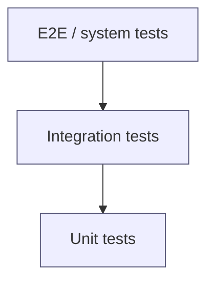
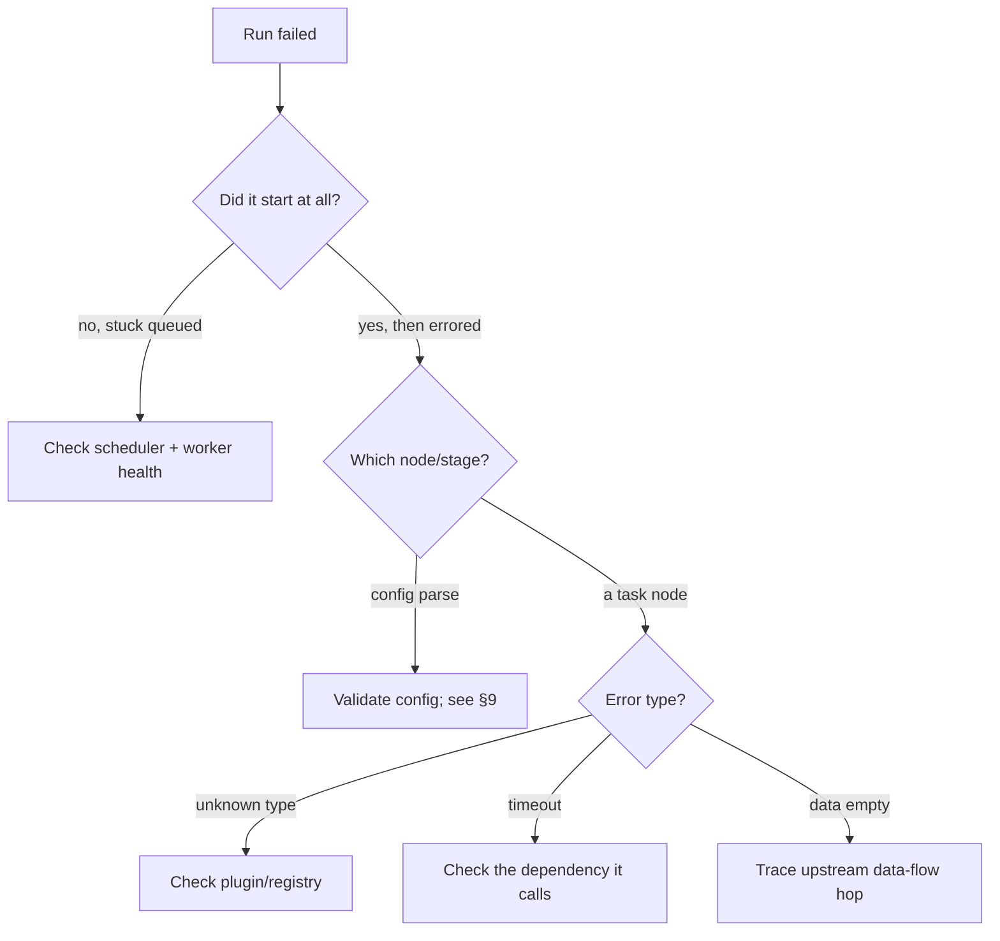

# Testing & debugging documentation guide

Two goals: (A) a reader can **run the existing tests and write new ones**, and (B) a reader can **diagnose and fix the common failures**. Both are reverse-engineered from the code, test suites, and error-handling paths.

---

## A. Testing

### Discover the test setup

- Find test directories and the runner (`pytest`, `jest`/`vitest`, `go test`, `cargo test`, JUnit, RSpec) and its config.
- Identify which **layers** exist and how they are separated (by directory, marker, or naming):
  - **Unit** — single function/class, no I/O.
  - **Integration** — multiple components + real-ish dependencies (DB, queue), often via test containers.
  - **End-to-end / system** — the whole product through its real entry point.
  - **Contract** — API/schema compatibility between services.
  - **Property / fuzz**, **load / performance**, **snapshot** — note if present.
- Find the **CI test stages** (they define what actually gates merges).

### Document, for the reader

1. **The test strategy & pyramid** — what each layer covers here and roughly the balance. Diagram it:

2. **How to run** — the exact commands: whole suite, one layer, one file, one test, with coverage, and in watch mode. Include how to bring up any dependencies tests need.
3. **Coverage** — how it's measured, where the report goes, and honestly where coverage is thin (cross-reference status §15).
4. **Fixtures, mocks, fakes** — the shared fixtures/factories, how external services are stubbed, and the project's convention (prefer fakes over mocks? test containers? recorded cassettes?).
5. **Test data** — how it's seeded/generated and cleaned up.
6. **Write a new test — worked example** — pick a representative unit and show the full flow: where to put the file, the naming convention, arranging fixtures, the assert style, and running it. Then note how to add an integration test (what to spin up) and an e2e test (what path to drive).
7. **CI gating** — which suites run on PR vs main, required checks, and how to reproduce a CI failure locally.

---

## B. Debugging & operations

### Observability inventory

Document what exists so a reader can *see* what's happening:

- **Logging** — the logging framework, how to raise verbosity (env/flag/config), log format and where logs go, and the most useful log lines per subsystem.
- **Metrics** — what's emitted and where it's viewed.
- **Tracing** — if distributed tracing exists, how to read a trace across services.
- **Health/readiness** — endpoints/checks and what "healthy" means.
- **Debug mode** — how to run locally with a debugger/breakpoints, dry-run, or verbose diagnostics.

### Failure modes → runbooks

For each subsystem (especially the orchestrator, any scheduler/DAG, agents/workers, plugin loader, config/DSL parser, and any dedicated service), enumerate the realistic failures and give a runbook row:

| Symptom (what the user/operator sees) | Likely cause | How to confirm | Fix / mitigation |
| --- | --- | --- | --- |
| Run stuck in "queued" | scheduler not consuming / worker down | check worker health + queue depth | restart worker; check queue connection |
| Node fails immediately with "unknown type" | config references an unregistered node/plugin type | grep registry for the type; check plugin load logs | register/enable the plugin; fix the `type` value |
| Config rejected on load | schema/semantic validation error | run the validate/lint command; read the error | correct the field; see config §9 |
| Device/service unreachable | network/auth/lifecycle (not connected) | check service health + connection state | reconnect/provision; check credentials |
| Partial/empty report | upstream node produced no data / aggregation skipped | trace the data-flow hop that's empty | fix upstream; check filters/params |

Pull these from the actual `raise`/`throw`/error-handling code, retry/timeout logic, and the states in the lifecycle diagrams. Include the exact error strings where you can, so a reader can search for them.

### Troubleshooting decision trees

For the top 2–4 failure classes, give a decision-tree flowchart the reader can follow:

### Reading failures

- Where the primary stack traces/error logs surface, and how to map an error back to a subsystem.
- Known gotchas and "it's usually this" shortcuts discovered in the code.
- Escalation: what state to capture (logs, config, run id, versions) before asking for help.

---

## FAQ authoring

Collect real questions encountered during discovery — the things that were confusing, surprising, or ambiguous. Good FAQ sources: doc/code drift you found, non-obvious defaults, "why does it do X", "can I do Y", setup snags, and the difference between similar concepts. Answer each directly in 2–4 sentences and link to the section with the full story. Aim for 8–20 questions grounded in *this* system, not generic ones.
